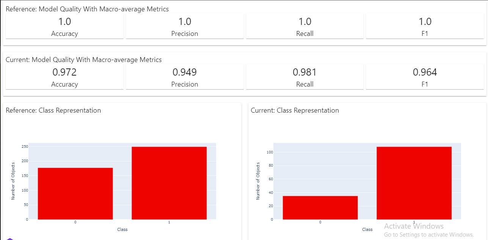

# evidently_model_analysis component

This ⚡ [Lightning component](lightning.ai) ⚡ was generated automatically with:

```bash
lightning init component evidently_model_analysis
```

## What problem is this component solving?
After training our model and generating predictions, this component helps identify if there is any kind of Model drift seen based on the model performance.

This component uses Evidently AI to facilitate this model performance analysis which is one of the crucial steps in the whole ML development lifecycle.

This is made primarily for tabular dataset analysis and currently supported tasks are classification or regression.

Stop looking at bland numbers which make limited sense, give the visualization a shot.

## To run evidently_model_analysis

First, install evidently_model_analysis (warning: this component has not been officially approved on the lightning gallery):

```bash
lightning install component https://github.com/Nachimak28/evidently_model_analysis
```

If the above does not work, manually setup the environment:

```bash
git clone https://github.com/Nachimak28/evidently-model-analysis
cd evidently-model-analysis
conda create --yes --name evidently python=3.8
conda activate evidently
python -m pip install -r requirements.txt
python -m pip install lightning
python -m lightning run app app.py
python -m lightning run app app.py --cloud
```

Once the app is installed, use it in an app:

Example #1 - Passing data during initialization

```python
import pandas as pd
from evidently_model_analysis import EvidentlyModelAnalysis
from lightning.app.frontend.web import StaticWebFrontend
import lightning as L

class LitApp(L.LightningFlow):
    def __init__(self, train_dataframe_path, test_dataframe_path, target_column_name, prediction_column_name, task_type='classification') -> None:
        super().__init__()
        self.train_dataframe_path = train_dataframe_path
        self.test_dataframe_path = test_dataframe_path
        self.target_column_name = target_column_name
        self.prediction_column_name = prediction_column_name
        self.task_type = task_type
        
        self.evidently_model_analysis = EvidentlyModelAnalysis(
                                                        train_dataframe_path=self.train_dataframe_path,
                                                        test_dataframe_path=self.test_dataframe_path,
                                                        target_column_name=self.target_column_name,
                                                        prediction_column_name=self.prediction_column_name,
                                                        task_type=self.task_type,
                                                        parallel=False)


    def run(self):
        self.evidently_model_analysis.run()


    def configure_layout(self):
        if self.evidently_model_analysis.report_path:
            tab_1 = {'name': 'Model report', 'content': self.evidently_model_analysis}
        else:
            tab_1 = []
        return tab_1

if __name__ == "__main__":
    # classification use case
    app = L.LightningApp(LitApp(
            train_dataframe_path='resources/ba_cancer_train_df_with_preds.csv',
            test_dataframe_path='resources/ba_cancer_test_df_with_preds.csv',
            target_column_name='target',
            prediction_column_name='prediction',
            task_type='classification'
        ))
```


Example #2

```python
# Note: This is not a complete example but is a demo of providing data to the component during the execution of the run method of some other component instead of providing data during the initialization

# provide payload arguments of the train and test dataframes transferred from another component

# some other component's run method:

class LitApp(L.LightningFlow):
    def __init__(self):
        self.other_component = OtherComponent()
        self.evidently_model_analysis = EvidentlyModelAnalysis() #default initialization

    def run(self):
        self.other_component.run()
        self.evidently_model_analysis.task_type = 'classification'
        self.evidently_model_analysis.target_column_name = 'target'
        self.evidently_model_analysis.prediction_column_name = 'prediction'
        # other_component has two attributes which are of type lightning.app.storage.payload.Payload which should be pandas dataframes
        self.evidently_model_analysis.run(
                                            train_df=self.other_component.train_df, 
                                            test_df=self.other_component.test_df
                                        )

    def configure_layout(self):
        if self.evidently_model_analysis.report_path:
            tab_1 = {'name': 'Model report', 'content': self.evidently_model_analysis}
        else:
            tab_1 = []
        return tab_1

if __name__ == "__main__":
    app = L.LightningApp(LitApp())

```

## Sample Output of the App



## TODO

- [x] Complete the readme
- [x] Test in Lightning cloud
- [ ] Write relevant tests and test locally

